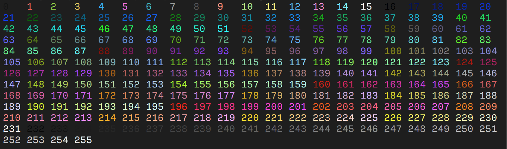

### ANSI colors (256 colors)

| ESC Code Sequence | Describtion          |
|-------------------|----------------------|
| `ESC[38;5;{ID}m`  | Set foreground color |
| `ESC[48;5;{ID}m`  | Set background color |

Where `{ID}` should be replaced with the color index from 0 to 
255 of the following color table:

[github](https://gist.github.com/fnky/458719343aabd01cfb17a3a4f7296797)

### ANSI colors (simple)

`ESC[{ID}m`

Where `{ID}` should be replaced with:
# ANSI Escape Code

### Normal colors:

| Color name | Foreground Color Code | Background Color Code |
|------------|-----------------------|-----------------------|
| Black      | `30`                  | `40`                  |
| Red        | `31`                  | `41`                  |
| Green      | `32`                  | `42`                  |
| Yellow     | `33`                  | `43`                  |
| Blue       | `34`                  | `44`                  |
| Magenta    | `35`                  | `45`                  |
| Cyan       | `36`                  | `46`                  |
| White      | `37`                  | `47`                  |
| Default    | `39`                  | `49`                  |
| Reset      | `0`                   | `0`                   |

### Bright colors:

| Color name        | Foreground Color Code | Background Color Code |
|-------------------|-----------------------|-----------------------|
| Bright Black      | `90`                  | `100`                 |
| Bright Red        | `91`                  | `101`                 |
| Bright Green      | `92`                  | `102`                 |
| Bright Yellow     | `93`                  | `103`                 |
| Bright Blue       | `94`                  | `104`                 |
| Bright Magenta    | `95`                  | `105`                 |
| Bright Cyan       | `96`                  | `106`                 |
| Bright White      | `97`                  | `107`                 |

